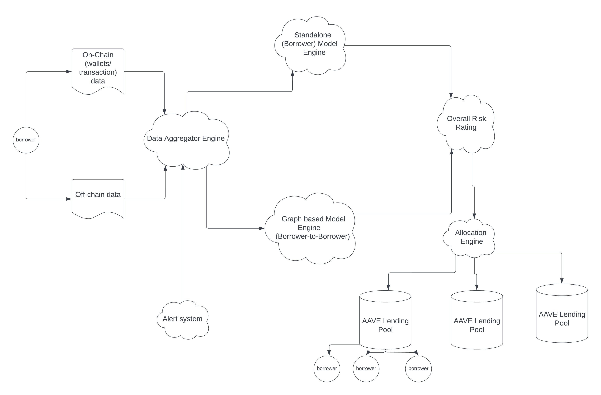

# Invictus Labs

## Description ##

The scope of Invictus Labs is to construct a platform for measuring the credit risk of DeFi (lending) pools. We achieve that by modelling the relationships between entities that partake in borrowing through causal inference and machine learning techniques. 

Sophisticated financial institutions in TradFi model various types of risks, such as credit, counterparty, market, political, country risks. 

In order to mitigate risk, there exist two well known techniques:

- qualitative - methods that do not require a model. Here, the risk is assesed using mostly expert-driven techniques.
- quantitative - a mathematical model is used, allowing for more elaborate analysis.

## Value added (AAVE) ##
For example, we can answer questions such as how the risk of a malicious borrower could ‘’intoxicate’’ others, via ripple effects.

- building trust and transparency in the lending pool, ensuring more liquidity will be deployed as a consequence
- more borrowers will be incentivised to take undercollateralized loans due to available liquidity,  and less interest paid
- borrowers who do not disclose information about their status or financial statements will receive a high risk rating
- real time event-driven alert system that will update the risk ratings 
## Methods ##
* Copula model (our benchmark)
* Stand-alone model (also known as Borrower model)
* Graph-based model (also known as Borrower-to-Borrower model)

## Architecture ##

### Data ###

What kind of data we use and how do we structure it?

- **On-chain data** module: use (wallet) transaction data on DeXes, metrics from wallet addresses
- **Off-chain data** module: use balance sheets, margin/leverage history, equity/liquidity,  business registration details, historical business data, payment history and collections, public fillings, etc.

- **Data aggregator engine**: will combine the previous 2 modules, and will output structured *entities* and *relationships* between entities. We will use a domain-expert, along with a text-to-entity machine learning approach, by  capturing entities and relationships from unstructured text data.

**What if the borrower does not offer sufficient off-chain data?** 
For this situation, we have economic incentive mechanisms in place to reward the borrower for data sharing. That is, lack of shared information will lead to a higher credit risk rating, which will determine the system to make a poor interest rate offering. Furthermore, we will also make use of existing APIs that track unstructured text data, such as from Twitter, Discord, etc. to derive the risk level from the captured borrower's behaviour. Lastly, our real-time **Alert System** makes use of existing API market services (such as Bloomberg, Moonpass, Nansen) to track whether a specific event/news will increase/decrease the borrower's risk of default.

### Copula model (our benchmark) ###

A copula model is a type of mathematical model that is used to describe the dependence between different sources of risk. In the context of credit risk, a copula model can be used to understand the relationship between the likelihood of a borrower defaulting on a loan and the potential impact of that default on the lender or other borrowers.

The model consists of two components: a *marginal* model, which describes the distribution of the individual sources of risk, and a *copula* function, which describes the dependence between those sources of risk. The marginal model can be specified using a variety of different parametric forms, such as the logistic or normal distributions, while the copula function can be specified using a variety of different parametric forms, such as the Gaussian or Clayton copulas. 

### Borrower model ###
A stand-alone model is a neural network model trained on the data structured in the **Data Aggregator Engine**, outputting the credit risk of default for a borrower, without taking into account any other systemic risk created by other players in the field. This is used to calculate the **Individual credit risk** (see below). 

### Borrower-to-Borrower model ###
In light of crypto recent events, borrower activities both depend upon and have consequences on the DeFi/Web3 ecosystem. *Knowledge graphs* are able to synthesize different kinds of knowledge and explicitly account for the probabilities of different scenarios, therefore offering a very useful tool for risk assesment. 

In other words, one can answer questions about the probability of the default of a borrower A based on having exposure or a transitive relationship to borrower B.  

In order to build the graph model, the **Data Aggregator Engine** will fetch as input what *On-chain* and *Off-Chain* data modules offer, offering as output a tuple under the form *(Entity, Relationship, Entity)*. The on-chain data is more structured, by connecting wallets/pools as entities  and transactions (with their corresponding numerical values) as relationships.
For the off-chain data (such as reports, balance sheets, etc), we will make use of both a domain expert and a text-to-entity approach, by identifying entities and relationships. 

We need to quantify the relationships between entities. Hence, every edge in the knowledge graph will have a numerical value that will tell how dependent an entity is on another entity. 
Rather than spanning out a very large number of edges, we need to abstract out of them, by combining multiple relations that an entity A may have with entity B into a single one, with a corresponding risk impact. In other words, not all relationships matter equallyin terms of importance. What influence their importance is the impact on a risk metric.

As an example, imagine there is a borrower A who is connected to FTX who gave out a huge loan to Alameda - hence, entity A is connected to 'FTX' by a relation, while 'Alameda' and 'FTX' will be connected by another relation.

Hence, this dependency may influence borrower A's ability to pay back his loan.  The most important thing is to measure the relations between entities, and how this affects the risk metric, we will make use of a Bayesian network.

*Bayesian networks* (causal inference models) are a type of probabilistic graphical model that explicitly describe
dependencies between a set of variables using a directed acyclic graph (DAG) and a set of
node probability tables (NPTs). Each node in a DAG has a node probability table (NPT) which describes the probability
distribution of the node conditional on its parents.

Then, based on the specific factors, such as exposure, loans, team being implied into a bad activity, etc, we will update the risk impact on the knowledge graph edges. 

## Risk assesment methodology ##

For every borrower, we will construct a **Overall risk score** which is composed of the output of model trained on the data offered by the borrower/ any externally accesibile data sources (**Individual credit risk**), along with the output of the knowledge graph inference model based on its relation with other borrowers (**Systemic Credit Risk**). See below:

*Individual Credit Risk* - i.e., risk of default of a borrower considered as a **stand-alone entity**.  It is obtained via assesing the risk of default obtained from training a model based on the data provided via the *Data Aggregator Engine*.

*Systemic Credit Risk* - obtained from the output of the Bayesian network, which will determine what is the risk of default if being exposed to another borrowers or external entities.

The **Overall risk score** of a borrower is a weighted average between *Individual Credit Risk* and *Systemic Credit Risk*, with the exact weights to be determined via experiments, or as a dynamic weighting mechanism, based on market regime. 

## Allocation Engine ##
The **Allocation Engine** constructs a diversified "portfolio" of borrowers allocated to specific pools given different constraints, such as the overall lending pool risk is minimized, available liquidity exists, etc. We will make use of state of the art portfolio allocation algorithms from Hudson and Thames to speed up the allocation process.

