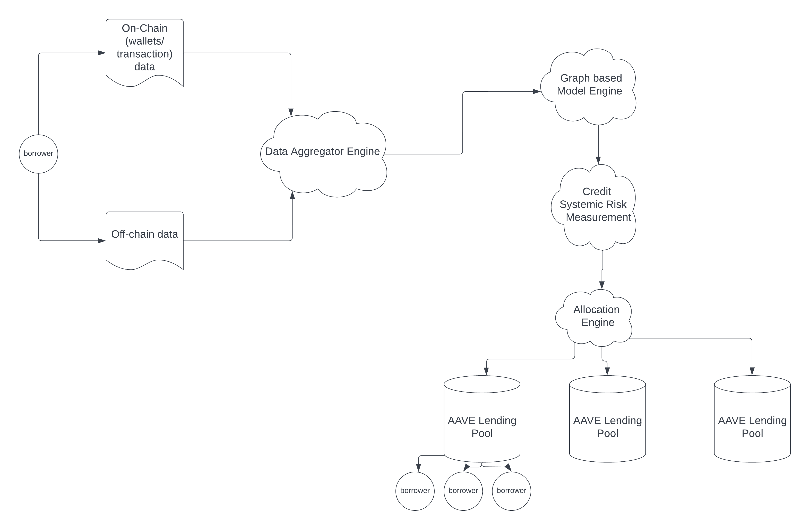

# Invictus Labs

## Description ##

The scope of this project is to construct a platform for measuring the credit risk of DeFi (lending) pools, by modelling the relationships between entities that partake in borrowing through causal inference and machine learning techniques. 

Sophisticated financial institutions in TradFi model various types of risks, such as credit, counterparty, market, political, country risks. 

In order to mitigate risk, there exist two well known techniques:

- qualitative - methods that do not require a model. Here, the risk is assesed using mostly expert-driven techniques.
- quantitative - a mathematical model is used, allowing for more elaborate analysis.

## Value added ##
For example, we can answer questions such as how the risk of a malicious borrower could ‘’intoxicate’’ others, via ripple effects.
## Benchmarks ##
* Copula model
* Knowledge graph-based model

## Architecture ##

### Data ###

What kind of data we use and how are we going to structure it? 
- **On-chain data** module: use (wallet) transaction data on DeXes, metrics from wallet addresses
- **Off-chain data** module: use balance sheets, margin/leverage history, equity/liquidity,  business registration details, historical business data, payment history and collections, public fillings, etc.
- **Data aggregator engine**: will combine the previous 2 modules, and will output structured *entities* and *relationships* between entities.

### Expert-driven model ###

### Copula model ###
- quantitative method for assesing credit risk
- use of a factor model based on joint multi-variate normal distribution properties

### Graph-based model ###
In light of crypto recent events, borrower activities both depend upon and have consequences on the DeFi/Web3 ecosystem. Bayesian networks are able to synthesize different kinds of knowledge and explicitly account for the probabilities of different scenarios, therefore offering a very useful tool for risk assesment. 

Bayesian networks (causal inference models) are a type of probabilistic graphical model that explicitly describe
dependencies between a set of variables using a directed acyclic graph (DAG) and a set of
node probability tables (NPTs). Each node in a DAG has a node probability table (NPT) which describes the probability

distribution of the node conditional on its parents.

In order to build the model, we will need a **Data Aggregator Engine** which combines the **On-Chain Data**

* Text to entity engine (using Transformer or Bidirectional LSTM architecture)
* Relationship modelling
* Quantify the impact of the relationship between entities
* Risk assesment engine

